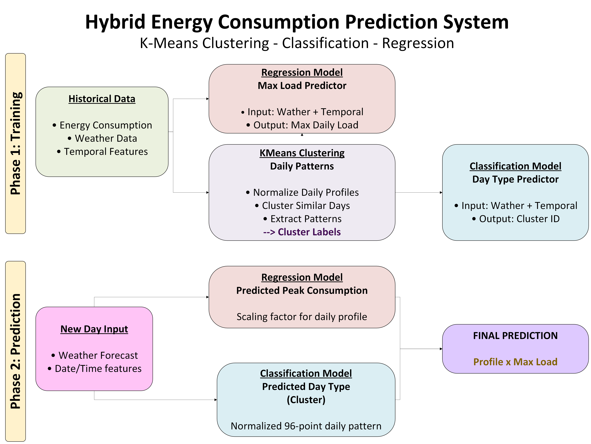
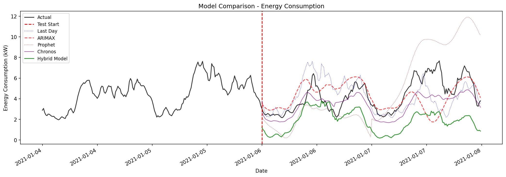

# Hybrid Machine Learning Approach for Short-Term Load Forecasting

This repository contains the code released with a research paper on short-term load forecasting for small commercial buildings. The project implements a hybrid pipeline that separates daily load shape from daily load magnitude, then combines both elements into a final forecast that can be compared against statistical baselines and more recent forecasting models. The code is organized as a reproducible Python workflow, with the full pipeline launched from `main.py` and the individual stages available under `src/`.

## Context

Small commercial buildings are hard to forecast because their demand is influenced by noisy measurements, irregular occupancy, calendar effects, and weather-driven variability. In this type of setting, a single end-to-end model often struggles to represent the daily operating pattern and the changing scale of consumption at the same time. This repository follows a more structured idea: it first learns recurring daily shapes and then predicts the magnitude needed to rescale those shapes back to physical load values.

The analysis is based on real building data collected at 15-minute intervals in Murcia, Spain. Because the original dataset is private, it cannot be fully distributed here. To keep the repository useful, a small sample of days has been left in `data/` so that the code can be inspected, executed, and validated without exposing the complete operational dataset.

## Process and Methodology

The pipeline is built as a sequence of stages that move from preprocessing to clustering, supervised prediction, and final benchmarking:

- **Data preparation:** the raw time series is aligned, optionally smoothed with a short rolling filter, and converted into daily profiles so that shape and magnitude can be handled separately.
- **Interval-based clustering:** each day is summarized through several time-of-day interval configurations, and K-Means is used to identify recurring operational archetypes.
- **Day-type prediction:** a classifier learns to assign the most likely cluster to a future day using weather variables and calendar features.
- **Peak-load regression:** a regression model estimates the daily maximum load from exogenous variables, including lagged weather aggregates for the magnitude task.
- **Forecast synthesis and benchmarking:** the predicted cluster profile is rescaled by the predicted peak load, then evaluated against persistence, ARIMAX, Prophet, and zero-shot forecasting baselines.

To run the pipeline on the bundled sample data:

```bash
python main.py
```

The figure below summarizes the methodology used in the repository.



## Results

The main value of the approach is that it keeps the forecasting problem interpretable. Instead of treating each day as an unstructured sequence, the method learns a daily operating pattern and a separate scale factor. That design helps the model capture stable behavioral signatures while still adapting to the weather and calendar effects that drive changes in peak consumption.

The comparison figure shows the kind of output produced by the benchmarking stage, where the hybrid forecast is plotted against classical and modern alternatives over the test window. In the experiments associated with the paper, this decomposition-based strategy was the most competitive option for the filtered dataset and remained strong on the raw signal as well, particularly when compared with persistence-style methods and general-purpose forecasting models.

| Figure | Description |
|--------|-------------|
|  | Example comparison between the hybrid forecast and benchmark models over a representative evaluation period |

The result is a compact research codebase that is intended both as a reproducible artifact and as a practical template for similar building-energy forecasting problems. Since only a small sample of the private data can be shared, the repository is best understood as a working demonstration of the method and its implementation rather than a full public release of the experimental dataset.

## Authors

**Aitor Diez Mateo**

**Roberto Garay-Martinez**

**Cruz Enrique Borges**

**Ana García Garre**

---

## Acknowledgements

This work was carried out within the scope of the **Deusto Sustainable Research Group** at the University of Deusto.

---

## License

This project is released under the [Apache License 2.0](LICENSE).

---

*This work was supported by the European Union's Horizon Europe research and innovation programme, grant agreement No. 101172968 (Project STUNNED). Views and opinions expressed are those of the author(s) only and do not necessarily reflect those of the European Union or the granting authority.*
